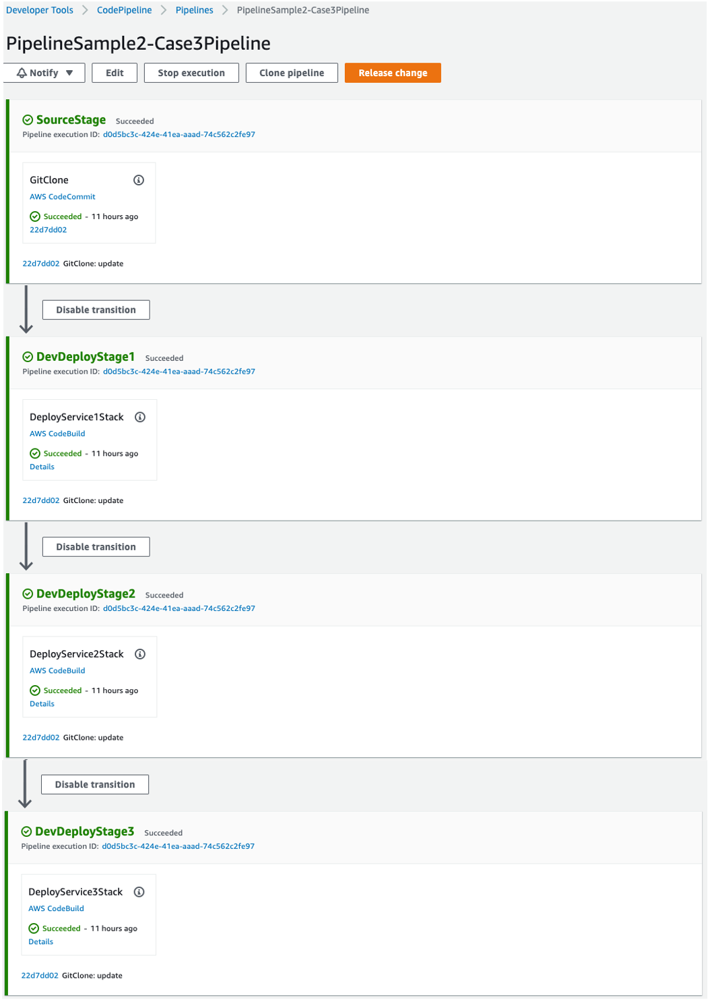
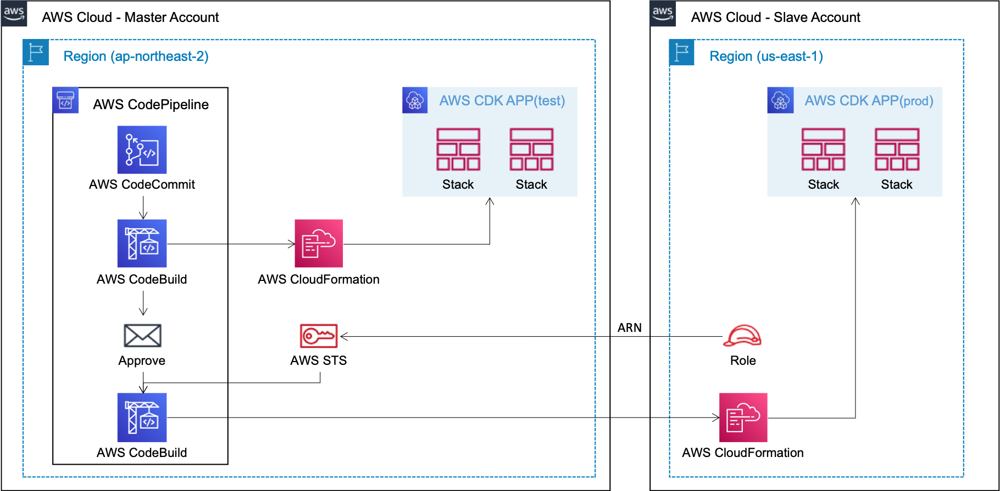

# AWS CDK Deploy Pipeline using AWS CodePipeline

 This repository describes how to customize AWS CodePipeline to deploy AWS CDK application. Specifically, this repository describes how to implement a deployment pipeline optimized for [AWS CDK Project Template for DevOps](https://github.com/aws-samples/aws-cdk-project-template-for-devops) in the simplest way with the least amount of effort. That is, if you specify only a name of source repository and the names of AWS CDK Stack you want to deploy selectively, a pipeline is automatically created for this.

## Agenda

 1. [Solution](#solution)

     1.1 [How to work](#how-to-work)

     1.2 [Prerequisite](#prerequisite)

     1.3 [How to use pipelines](#how-to-use-pipelines)

     1.4 [How to configure pipelines](#how-to-configure-pipelines)

     1.5 [Environment Variables](#environment-variables)

 2. [Advanced Usecases](#advanced-usecases)

     2.1 [Multiple Target Deployment](#multiple-target-deployment)

     2.2 [Cross-Account Target Deployment](#cross-account-target-deployment)

     2.3 [PrePost Build Commands Injection](#prepost-build-commands-injection)

     2.4 [Action Event Handling](#action-event-handling)

     2.5 [Temporary Deactivation](#temporary-deactivation)

     2.6 [Role Customizing](#role-customizing)

     2.7 [Build Project Customizing](#build-project-customizing)

     2.8 [CodePipeline Customizing](#codepipeline-customizing)

 3. [Limitation](#limitation)

 4. [Security](#security)

 5. [License](#license)

## Solution

 Configuring CDK application deployment pipeline is just as important as configuring AWS cloud resources with AWS CDK. To solve this purpose, an official pipeline-[CDK Pipelines](https://docs.aws.amazon.com/cdk/api/v2/docs/aws-cdk-lib.pipelines-readme.html) is being provided, and it fundamentally utilizes AWS CloudFormation Action in AWS CodePipeline's Deploy. As explained in the official documentation, this is not easy to customize as it is purpose-built.

### How to work

 This repository introduces a new CDK deployment pipeline for minimal effort and maximum customization without changes to existing CDK applications. By default, AWS CodeBuild is used so that you can insert any build scripts or AWS CLI commands with AWS CDK CLI commands you want as if you were running in your local development environment. In particular, this is abstracted so that it can be conveniently deployed in a stack unit without writing ```cdk deploy``` command in BuildSpec of AWS CodeBuild by yourself. If you simply list the names of the stacks you want to deploy, a AWS CodeBuild's BuildSpec document tailored to the AWS CDK deployment is created internally.

 This new pipeline opimized for AWS CDK deployment covers the following AWS CDK Application deployment cases.

 [Usecase 1] Test and Prod deployments in the same account & region

 

 [Usecase 2] Test and Prod deployments in the same account & different region

 

 [Usecase 3] Test and Prod deployments in the different account & region

 

### Prerequisite

* It must have been cdk-bootstrapped in the target account/region beforehand.
* ```Stage``` and ```Action``` terminologies are same as AWS CodePipeline.
* A AWS CodeCommit Repository named ```sample-repo``` and branch named ```release_cicd``` should be prepared in advance for the practice.
* The basic configuration concept(Stack dependency management, configuration-based stack deployment) was implemented on [AWS CDK Project Template for DevOps](https://github.com/aws-samples/aws-cdk-project-template-for-devops) project. We recommend that you read this project first.
* Because template framework is in [AWS CDK Project Template for DevOps](https://github.com/aws-samples/aws-cdk-project-template-for-devops), please prepare the source code like this. Specifically these repositories provide both CDK v1 and v2 through branch, please append branch name to identify them!

```bash
git clone https://github.com/aws-samples/aws-cdk-project-template-for-devops.git -b release_cdk_v1 or release_cdk_v2
git clone https://github.com/aws-samples/aws-cdk-deploy-pipeline-using-aws-codepipeline.git -b release_cdk_v1 or release_cdk_v2
cp -r aws-cdk-project-template-for-devops/lib aws-cdk-deploy-pipeline-using-aws-codepipeline
```

* Caution: You may be charged a small fee if you deploy through hands-on practice. For hands-on practice, account in ```config/app-config-xxxx.json``` file must be updated according to your environment.

### How to use pipelines

Basically, this provides a pipeline ```CDK Construct``` optimized for CDK deployment, and provides 3 approaches to make it convenient to use.


For now, don't worry about the detailed configuration, just understand the approach to how to use it. Detailed configuration will be described below. The example codes below are saved in the following [infra/stack/sample1](infra/stack/sample1), and you can deploy it right away by specifying a config file as follows.

```bash
export APP_CONFIG=config/app-config-sample1.json
cdk list

PipelineSample1-Approach1PipelineStack
PipelineSample1-Approach2PipelineStack
PipelineSample1-Approach3PipelineStack
PipelineSample1-Sample1Service1Stack
```

**Approach 1**: Use ```PipelineSimplePattern``` construct class directly

In any your Stack, use this construct class directly with specific options. In this case, you have to care all options by yourself. ```ActionFlow``` option is the most important, and you'll set it the same for any other approach.

```typescript
import * as base from '../../../lib/template/stack/base/base-stack';
import { AppContext } from '../../../lib/template/app-context';

import * as pipeline from '../../../lib/template/construct/pattern/pipeline-simple-pattern';


export class Approach1PipelineStack extends base.BaseStack {

    constructor(appContext: AppContext, stackConfig: any) {
        super(appContext, stackConfig);

        new pipeline.PipelineSimplePattern(this, 'Approach1', {
            projectPrefix: this.projectPrefix,
            stackConfig: this.stackConfig,
            stackName: this.stackName,
            env: this.commonProps.env!,
            pipelineName: 'Approach1Pipeline',
            actionFlow: [
                {
                    Name: 'GitClone',
                    Stage: 'SourceStage',
                    Kind: pipeline.ActionKind.SourceCodeCommit,
                    Enable: true,
                    Detail: {
                        RepositoryName: 'sample-repo',
                        BranchName: 'release_cicd'
                    }
                },
                {
                    Name: 'DeployAllStacks',
                    Stage: "DevDeployStage",
                    Kind: pipeline.ActionKind.BuildCodeBuild,
                    Enable: true,
                    Detail: {
                        AppConfigFile: "config/app-config-sample1.json",
                        BuildDeployStacks: {
                            StackNameList: ['Sample1Service1Stack'],
                        }
                    }
                }
            ]
        });
    }
}
```

**Approach 2**: Generalize ```PipelineBaseStack``` base class

Create a new Stack, where this stack have to generalize ```PipelineBaseStack``` base class. Becase this class is a abstract class, we have to override some methods. [Template Method Pattern in OOP](https://en.wikipedia.org/wiki/Template_method_pattern) is applied for guiding pipeline configuration. This approach only requires passing in a minimal set of options, as the base class knows all of the default options. If you want to create additional resources, you can start with ```onPostConstructor()``` method instead of ```constructor()``` method.

```typescript
import * as base from '../../../lib/template/stack/devops/pipeline-base-stack';
import { AppContext } from '../../../lib/template/app-context';
import { Override } from '../../../lib/template/stack/base/base-stack';

import * as pipeline from '../../../lib/template/construct/pattern/pipeline-simple-pattern';


export class Approach2PipelineStack extends base.PipelineBaseStack {
    private pipeline: pipeline.PipelineSimplePattern;

    constructor(appContext: AppContext, stackConfig: any) {
        super(appContext, stackConfig);
    }

    @Override
    onPostConstructor(pipeline: pipeline.PipelineSimplePattern): void {
        this.pipeline = pipeline;
    }

    @Override
    onPipelineName(): string {
        return 'Approach2Pipeline';
    }

    @Override
    onActionFlow(): pipeline.ActionProps[] {
        return [
            {
                Name: 'GitClone',
                Stage: 'SourceStage',
                Kind: pipeline.ActionKind.SourceCodeCommit,
                Enable: true,
                Detail: {
                    RepositoryName: 'sample-repo',
                    BranchName: 'release_cicd'
                }
            },
            {
                Name: 'DeployAllStacks',
                Stage: "DevDeployStage",
                Kind: pipeline.ActionKind.BuildCodeBuild,
                Enable: true,
                Detail: {
                    AppConfigFile: "config/app-config-sample1.json",
                    BuildDeployStacks: {
                        StackNameList: ['Sample1Service1Stack'],
                    }
                }
            }
        ];
    }
}
```

**Approach 3**: Generalize ```PipelineBaseStack``` base class and inject pipeline configuration using config file

This approach is same to approach 2, but in here we don't configure pipeline options directly in a Stack class. All options are configured in an external json file such as config/app-config-xxx.json.

```typescript
import * as base from '../../../lib/template/stack/devops/pipeline-base-stack';
import { AppContext } from '../../../lib/template/app-context';
import { Override } from '../../../lib/template/stack/base/base-stack';

import * as cicd from '../../../lib/template/construct/pattern/pipeline-simple-pattern';


export class Approach3PipelineStack extends base.PipelineBaseStack {
    private pipeline: cicd.PipelineSimplePattern;

    constructor(appContext: AppContext, stackConfig: any) {
        super(appContext, stackConfig);
    }

    @Override
    onPostConstructor(pipeline: cicd.PipelineSimplePattern): void {
        this.pipeline = pipeline;
    }

    @Override
    onPipelineName(): string {
        return this.stackConfig.PipelineName;
    }

    @Override
    onActionFlow(): cicd.ActionProps[] {
        return this.stackConfig.ActionFlow;
    }
}
```

Stack class implementation is very simple, and it can be reused by changing the config file only externally. The json shown below is an example of a config file that is set externally and injected.

```json
"Approach3Pipeline": {
    "Name": "Approach3PipelineStack",

    "PipelineName": "Approach3Pipeline",

    "ActionFlow": [
        {
            "Name": "GitClone",
            "Stage": "SourceStage",
            "Kind": "SourceCodeCommit",
            "Enable": true,

            "Detail": {
                "RepositoryName": "sample-repo",
                "BranchName": "release_cicd"
            }
        },
        {
            "Name": "DeployAllStacks",
            "Stage": "DevDeployStage",
            "Kind": "BuildCodeBuild",
            "Enable": true,
            "Detail": {
                "AppConfigFile": "config/app-config-sample1.json",
                "BuildDeployStacks": {
                    "StackNameList": ["Sample1Service1Stack"]
                }
            }
        }
    ]
}
```

The configuration shown above is injected from app-main.ts like this:

```typescript
new Approach3PipelineStack(appContext, appContext.appConfig.Stack.Approach3Pipeline);
```

### How to configure pipelines

 A pipeline can be defined as a ```AcionFlow``` option, and which is a sequence of ```Actions```. ActionFlow option must adhere to the following rules:

* The first item of the ```ActionFlow``` must be a ```Source``` kind such as ```SourceCodeCommit``` or ```SourceS3Bucket```
* The ```ActionFlow``` must contain at least two items, that means Source Action kind + Other Action kinds

 For detailed explanation, suppose we have 3 MSA service stacks and 1 pipeline stack like this:

```bash
export APP_CONFIG=config/app-config-sample2.json
cdk list

PipelineSample2-Sample2Service1Stack
PipelineSample2-Sample2Service2Stack
PipelineSample2-Sample2Service3Stack
PipelineSample2-Sample2PipelineStack
```

Depending on the dependencies of the stacks and the deployment strategy, we can think of a pipeline configuration by dividing it into four cases as follows. Full source code is ready in [infra/stack/sample2/sample2-pipeline-stack.ts](infra/stack/sample2/sample2-pipeline-stack.ts).

**Case 1**: Deploy all stacks in a single AWS CodeBuild project within a Stage

If the stacks are tightly dependent on each other and of cource deployment lifecycle is same, this approach is suitable. The following settings will deploy three stacks sequentially in one AWS CodeBuild project in one Stage.

```typescript
private createCase1Pipeline() {
    new pipeline.PipelineSimplePattern(this, 'case1', {
        projectPrefix: this.projectPrefix,
        stackConfig: this.stackConfig,
        stackName: this.stackName,
        env: this.commonProps.env!,
        pipelineName: 'Case1Pipeline',
        actionFlow: [
            {
                Name: 'GitClone',
                Stage: 'SourceStage',
                Kind: pipeline.ActionKind.SourceCodeCommit,
                Enable: true,
                Detail: {
                    RepositoryName: 'sample-repo',
                    BranchName: 'release_cicd'
                }
            },
            {
                Name: 'DeployAllStacks',
                Stage: "DevDeployStage",
                Kind: pipeline.ActionKind.BuildCodeBuild,
                Enable: true,
                Detail: {
                    AppConfigFile: "config/app-config-sample2.json",
                    BuildDeployStacks: {
                        StackNameList: ['Sample2Service1Stack', 'Sample2Service2Stack', 'Sample2Service3Stack'],
                    }
                }
            }
        ]
    })
}
```

The configuration shown above will automatically generate the following BuildSpec file. Internally, it sets up creates AWS CDK environment and deployment commands. Particularly, ```StackNameList: ['Sample2Service1Stack', 'Sample2Service2Stack', 'Sample2Service3Stack']``` option will generate ```cdk deploy *StackName*  --require-approval never``` command list.

```yaml
{
  "version": "0.2",
  "phases": {
    "install": {
      "runtime-versions": {
        "nodejs": 14
      },
      "commands": [
        "npm install -g aws-cdk@1",
        "npm install"
      ]
    },
    "pre_build": {},
    "build": {
      "commands": [
        "cdk deploy *Sample2Service1Stack* --require-approval never",
        "cdk deploy *Sample2Service2Stack* --require-approval never",
        "cdk deploy *Sample2Service3Stack* --require-approval never"
      ]
    },
    "post_build": {}
  },
  "artifacts": {
    "files": [
      "**/*"
    ],
    "exclude-paths": [
      "cdk.out/",
      "node_modules/",
      ".git/"
    ]
  }
}
```

Here's the final deployed pipeline:


**Case2**: Deploy each stack in each AWS CodeBuild project in one Stage.

If the stacks are loosely coupled on each other and deployment lifecycle is same, this approach is suitable. The following settings will deploy three stacks sequentially in each AWS CodeBuild project in one Stage.

```typescript
private createCase2Pipeline() {
    new pipeline.PipelineSimplePattern(this, 'case2', {
        projectPrefix: this.projectPrefix,
        stackConfig: this.stackConfig,
        stackName: this.stackName,
        env: this.commonProps.env!,
        pipelineName: 'Case2Pipeline',
        actionFlow: [
            {
                Name: 'GitClone',
                Stage: 'SourceStage',
                Kind: pipeline.ActionKind.SourceCodeCommit,
                Enable: true,
                Detail: {
                    RepositoryName: 'sample-repo',
                    BranchName: 'release_cicd'
                }
            },
            {
                Name: 'DeployService1Stack',
                Stage: "DevDeployStage",
                Kind: pipeline.ActionKind.BuildCodeBuild,
                Enable: true,
                Order: 1,
                Detail: {
                    AppConfigFile: "config/app-config-sample2.json",
                    BuildDeployStacks: {
                        StackNameList: ['Sample2Service1Stack'],
                    }
                }
            },
            {
                Name: 'DeployService2Stack',
                Stage: "DevDeployStage",
                Kind: pipeline.ActionKind.BuildCodeBuild,
                Enable: true,
                Order: 2,
                Detail: {
                    AppConfigFile: "config/app-config-sample2.json",
                    BuildDeployStacks: {
                        StackNameList: ['Sample2Service2Stack'],
                    }
                }
            },
            {
                Name: 'DeployService3Stack',
                Stage: "DevDeployStage",
                Kind: pipeline.ActionKind.BuildCodeBuild,
                Enable: true,
                Order: 3,
                Detail: {
                    AppConfigFile: "config/app-config-sample2.json",
                    BuildDeployStacks: {
                        StackNameList: ['Sample2Service3Stack'],
                    }
                }
            }
        ]
    })
}
```

It is important here that the stage names are all the same. Bacause all stage names are same with different action name, this will result in the following commands internally in each AWS CodeBuild project.

1st Build Project

```bash
cdk deploy *Sample2Service1Stack*
```

2nd Build Project

```bash
cdk deploy *Sample2Service1Stack*
```

3rd Build Project

```bash
cdk deploy *Sample3Service1Stack*
```

Here's the final deployed pipeline:


**Case3**: Deploy each stack in each AWS CodeBuild project of each Stage

If the stacks are to be deployed sequentially, each in an independent environment, this approach is suitable. The following settings will deploy three stacks sequentially in each AWS CodeBuild project in different Stages.

```typescript
private createCase3Pipeline() {
    new pipeline.PipelineSimplePattern(this, 'case3', {
        projectPrefix: this.projectPrefix,
        stackConfig: this.stackConfig,
        stackName: this.stackName,
        env: this.commonProps.env!,
        pipelineName: 'Case3Pipeline',
        actionFlow: [
            {
                Name: 'GitClone',
                Stage: 'SourceStage',
                Kind: pipeline.ActionKind.SourceCodeCommit,
                Enable: true,
                Detail: {
                    RepositoryName: 'sample-repo',
                    BranchName: 'release_cicd'
                }
            },
            {
                Name: 'DeployService1Stack',
                Stage: "DevDeployStage1",
                Kind: pipeline.ActionKind.BuildCodeBuild,
                Enable: true,
                Detail: {
                    AppConfigFile: "config/app-config-sample2.json",
                    BuildDeployStacks: {
                        StackNameList: ['Sample2Service1Stack'],
                    }
                }
            },
            {
                Name: 'DeployService2Stack',
                Stage: "DevDeployStage2",
                Kind: pipeline.ActionKind.BuildCodeBuild,
                Enable: true,
                Detail: {
                    AppConfigFile: "config/app-config-sample2.json",
                    BuildDeployStacks: {
                        StackNameList: ['Sample2Service2Stack'],
                    }
                }
            },
            {
                Name: 'DeployService3Stack',
                Stage: "DevDeployStage3",
                Kind: pipeline.ActionKind.BuildCodeBuild,
                Enable: true,
                Detail: {
                    AppConfigFile: "config/app-config-sample2.json",
                    BuildDeployStacks: {
                        StackNameList: ['Sample2Service3Stack'],
                    }
                }
            }
        ]
    })
}
```

Note that both Action name and Stage name are different. Here's the final deployed pipeline:



**Case4**: Deploy all stacks simultaneously in each AWS CodeBuild project of a single Stage

If the stacks are completely independent on each other and deployment lifecycle is same, this approach is suitable. The following settings will deploy three stacks at the same time in each AWS CodeBuild project within one Stage.

```typescript
private createCase4Pipeline() {
    new pipeline.PipelineSimplePattern(this, 'case4', {
        projectPrefix: this.projectPrefix,
        stackConfig: this.stackConfig,
        stackName: this.stackName,
        env: this.commonProps.env!,
        pipelineName: 'Case4Pipeline',
        actionFlow: [
            {
                Name: 'GitClone',
                Stage: 'SourceStage',
                Kind: pipeline.ActionKind.SourceCodeCommit,
                Enable: true,
                Detail: {
                    RepositoryName: 'sample-repo',
                    BranchName: 'release_cicd'
                }
            },
            {
                Name: 'DeployService1Stack',
                Stage: "DevDeployStage",
                Kind: pipeline.ActionKind.BuildCodeBuild,
                Enable: true,
                Order: 1,
                Detail: {
                    AppConfigFile: "config/app-config-sample2.json",
                    BuildDeployStacks: {
                        StackNameList: ['Sample2Service1Stack'],
                    }
                }
            },
            {
                Name: 'DeployService2Stack',
                Stage: "DevDeployStage",
                Kind: pipeline.ActionKind.BuildCodeBuild,
                Enable: true,
                Order: 1,
                Detail: {
                    AppConfigFile: "config/app-config-sample2.json",
                    BuildDeployStacks: {
                        StackNameList: ['Sample2Service2Stack'],
                    }
                }
            },
            {
                Name: 'DeployService3Stack',
                Stage: "DevDeployStage",
                Kind: pipeline.ActionKind.BuildCodeBuild,
                Enable: true,
                Order: 1,
                Detail: {
                    AppConfigFile: "config/app-config-sample2.json",
                    BuildDeployStacks: {
                        StackNameList: ['Sample2Service3Stack'],
                    }
                }
            }
        ]
    })
}
```

Because Stage name is the same, they are grouped into one stage, and because ```Order``` is the same, they are deployed at the same time.

Here's the final deployed pipeline:


### Environment Variables

The following environment variables are provided to the build project. You can use these when you write a customized build commands.

The example values were written based on ```app-config-sample2.json``` config file.

|Variable Name|Example Value|
|-------|-------------------|
|ACCOUNT|12345678901|
|REGION|us-east-2|
|PROJECT_NAME|Pipeline|
|PROJECT_STAGE|Sample2|
|PROJECT_PREFIX|PipelineSample2|
|APP_CONFIG|config/app-config-sample2.json|
|ON_PIPELINE|YES|
|||

## Advanced Usecases

Full source code is ready in [infra/stack/sample3](infra/stack/sample3).

### Multiple Target Deployment

You can deploy test/prod stages step by step by using the config files that have the target environment, and you can put an approval step in the middle.

```typescript
{
    Name: "TestDeployStacks",
    Stage: "TestStage",
    Kind: pipeline.ActionKind.BuildCodeBuild,
    Enable: true,
    Detail: {
        AppConfigFile: "config/app-config-sample3-test.json",
        BuildDeployStacks: {
            StackNameList: ["Sample3Service1Stack"],
        }
    }
},
{
    Name: "ApproveManually",
    Stage: "ApproveStage",
    Kind: pipeline.ActionKind.ApproveManual,
    Enable: true,
    Detail: {
        Description: "Must check stacks before prod"
    }
},
{
    Name: "ProdDeployStacks",
    Stage: "ProdStage",
    Kind: pipeline.ActionKind.BuildCodeBuild,
    Enable: true,
    Detail: {
        AppConfigFile: "config/app-config-sample3-prod.json",
        BuildDeployStacks: {
            StackNameList: ["Sample3Service1Stack"],
        }
    }
}
```

In here, ```app-config-sample3-test.json```'s destination is ```us-east-2```, ```app-config-sample3-prod.json```'s destination is ```us-east-1```. That is, Test-Stage deploy the stacks to ```us-east-2``` and Prod-Stage deploy the stacks to ```us-east-1```. This is a example case for cross-region distribution.

For deployment, execute the following command.

```bash
export APP_CONFIG=config/app-config-sample3.json
cdk list
...
...
PipelineSample3-Sample3PipelineStack

cdk deploy *Sample3PipelineStack
...
...

git push [remote repo name] [branch name]
```

Here's the final deployed pipeline:


### Cross-Account Target Deployment

You can deploy each test/prod stage to the difference account/region. Mostly the same as Multiple Target Deployment above, the only difference is that you have to specify the difference accoun in config json file and prepare assume-role.

```typescript
{
    Name: 'TestDeployStacks',
    Stage: "TestStage",
    Kind: pipeline.ActionKind.BuildCodeBuild,
    Enable: true,
    Detail: {
        AppConfigFile: "config/app-config-sample3-test.json",
        BuildDeployStacks: {
            PreCommands: ['aws sts get-caller-identity'],
            StackNameList: ['Sample3Service1Stack'],
        }
    }
},
{
    Name: 'ApproveManually',
    Stage: 'ApproveStage',
    Kind: pipeline.ActionKind.ApproveManual,
    Enable: true,
    Detail: {
        Description: 'Must check stacks before prod'
    }
},
{
    Name: 'ProdDeployStacks',
    Stage: "ProdStage",
    Kind: pipeline.ActionKind.BuildCodeBuild,
    Enable: true,
    Detail: {
        AppConfigFile: "config/app-config-sample3-prod-cross.json",
        BuildDeployStacks: {
            PreCommands: ['aws sts get-caller-identity'],
            StackNameList: ['Sample3Service1Stack'],
        },
        BuildAssumeRoleArn: 'arn:aws:iam::[your account number]:role/[your assume-role name]'
    }
}
```

In here, ```app-config-sample3-test.json```'s destination is A-account, ```config/app-config-sample3-prod-cross.json```'s destination is ```B-account```. And ```BuildAssumeRoleArn``` option is added, where the ```assume-role``` must have a minimu policy for a target Stack deployment, and the role must be set to trust the account where the pipeline is ready.

As shown in the following figure, temporary credentials are internally created using AWS STS to access the account.



### PrePost Build Commands Injection

You can inject build commands before and after deploying the stacks. This allows you to set up the environment, build some modules, perform unit tests, and so on.

```typescript
{
    Name: 'DeployStack1',
    Stage: "DevDeployStage",
    Kind: pipeline.ActionKind.BuildCodeBuild,
    Enable: false,
    Detail: {
        AppConfigFile: "config/app-config-sample1.json",
        BuildDeployStacks: {
            PreCommands: [
                'npm install --prefix code/lambda/api',
                'pytest code/lambda/api/test'
            ],
            StackNameList: ['Sample1Service1Stack'],
            PostCommands: [
                'aws s3 sync code/lambda/api/report s3://aaa/bb/cc'
            ]
        }
    }
}
```

### Action Event Handling

If you specify a lambda function as follows, the event is delivered at the time of each action change and the lambda is automatically called.

```typescript
{
    Name: 'DeployStack1',
    Stage: "DevDeployStage",
    Kind: pipeline.ActionKind.BuildCodeBuild,
    Enable: false,
    EventStateLambda: {
        CodePath: 'code/lambda/cicd-event-state',
        Handler: 'handler.handle',
        Runtime: 'python3.7'
    },
    Detail: {
        AppConfigFile: "config/app-config-sample1.json",
        BuildDeployStacks: {
            StackNameList: ['Sample1Service1Stack'],
        }
    }
}
```

### Temporary Deactivation

The ```disable``` option allows you to temporarily disable certain Actions without removing the complex options.

```typescript
{
    Name: 'DeployStack1',
    Stage: "DevDeployStage",
    Kind: pipeline.ActionKind.BuildCodeBuild,
    Enable: false,
    Detail: {
        AppConfigFile: "config/app-config-sample1.json",
        BuildDeployStacks: {
            StackNameList: ['Sample1Service1Stack'],
        }
    }
},
{
    Name: 'DeployStack2',
    Stage: "DevDeployStage",
    Kind: pipeline.ActionKind.BuildCodeBuild,
    Enable: true,
    Detail: {
        AppConfigFile: "config/app-config-sample1.json",
        BuildDeployStacks: {
            StackNameList: ['Sample2Service1Stack'],
        }
    }
}
```

### Role Customizing

If IAM Policies are not specified through the following method, ```AdministratorAccess``` permission is automatically granted.

#### For Construct approach

```typescript
const pipeline = new cicd.PipelineSimplePattern(this, 'Approach1', {
    projectPrefix: this.projectPrefix,
    stackConfig: this.stackConfig,
    stackName: this.stackName,
    env: this.commonProps.env!,
    pipelineName: 'Approach1Pipeline',
    actionFlow: [
    ],
    buildPolicies: this.createCustomPolicies()
});

private createCustomPolicies(): iam.PolicyStatement[] {
    const statement = new iam.PolicyStatement();
    statement.addActions(
        "cognito:*",
        "dynamodb:*",
        "application-autoscaling:*",
        "elasticloadbalancingv2:*",
        "elasticloadbalancing:*",
    );
    statement.addResources("*");

    return [statement];
}
```

#### For BaseClass approach

```typescript
@Override
protected onBuildPolicies(): iam.PolicyStatement[] | undefined {
    const statement = new iam.PolicyStatement();
    statement.addActions(
        "cognito:*",
        "dynamodb:*",
        "application-autoscaling:*",
        "elasticloadbalancingv2:*",
        "elasticloadbalancing:*",
    );
    statement.addResources("*");

    return [statement];
}
```

### Build Project Customizing

Because we provide the other options to execute AWS CodeBuild ```project```, you can customize the build project through the following two options.

#### For Build-Spec

```typescript
{
    Name: 'DeployAllStacks',
    Stage: "DevDeployStage",
    Kind: pipeline.ActionKind.BuildCodeBuild,
    Enable: true,
    Detail: {
        AppConfigFile: 'config/app-config-sample1.json',
        BuildSpecFile: 'script/cicd/buildspec_cdk_deploy.yaml'
    }
}
```

#### For Shell-Script

```typescript
{
    Name: 'DeployAllStacks',
    Stage: "DevDeployStage",
    Kind: pipeline.ActionKind.BuildCodeBuild,
    Enable: true,
    Detail: {
        AppConfigFile: 'config/app-config-sample1.json',
        BuildCommands: [
            'pwd',
            'ls -l',
            'script/cicd/install_dependencies.sh',
            'script/cicd/unit_test.sh',
            'script/cicd/deploy_stacks.sh',
        ]
    }
}
```

### CodePipeline Customizing

Because we provide ```CodePipeline``` instance as a public member variable, you can customize anything using this object.

#### For Construct approach

```typescript
const pipeline = new cicd.PipelineSimplePattern(this, 'Approach1', {
    projectPrefix: this.projectPrefix,
    stackConfig: this.stackConfig,
    stackName: this.stackName,
    env: this.commonProps.env!,
    pipelineName: 'Approach1Pipeline',
    actionFlow: [
    ]
})

const codePipeline = pipeline.codePipeline;
codePipeline.addStage(.....);
```

#### For BaseClass approach

```typescript
@Override
onPostConstructor(pipeline: pipeline.PipelineSimplePattern): void {
    this.pipeline = pipeline;

    const codePipeline = pipeline.codePipeline;
    codePipeline.addStage(.....);
}
```

## Limitation

Currently, the following limitations exist and will be improved soon.

* cross-account Deployments: completed
* AWS CodeBuild environment settings
* self-mutating

## Security

See [CONTRIBUTING](CONTRIBUTING.md#security-issue-notifications) for more information.

## License

This library is licensed under the MIT-0 License. See the LICENSE file.
